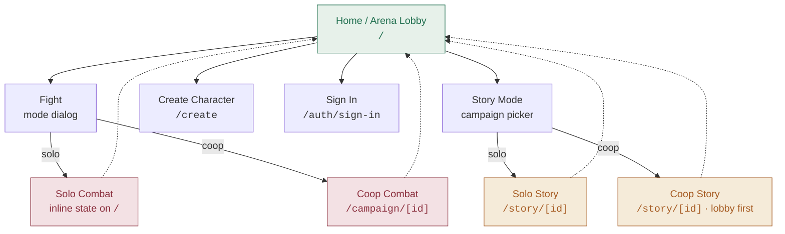

# dnd-game — Documentation

A re-orientation guide for the browser-based D&D game: every screen you can reach, how the four play modes connect, and what happens scene by scene inside a story campaign.

## What this is

A Next.js 15 App Router app that combines random-monster arena fights, coop party campaigns, and scripted narrative stories. Every mode shares one combat engine, one character model, and one home screen. Backed by Supabase (Postgres + Auth + Realtime + Storage).

The entry point `/` is not a marketing home — it *is* the game. The **Arena Lobby** component renders the home dashboard when idle and swaps in the combat UI in place when a fight starts. Every non-home screen has a back-to-home link in the top-left. There is no persistent nav bar.

## Contents

1. **[Play modes](./play-modes.md)** — Solo Combat, Coop Combat, Solo Story, Coop Story: what each is, how to reach it, how it flows.
2. **[Story mode](./story-mode.md)** — Create flow, the scene loop, solo/coop/DM play surfaces, and cross-cutting mechanics.
3. **[Campaigns](./campaigns/README.md)** — The three story campaigns (Goblin Warrens, Haunted Manor, Wyrm's Hollow) with scene-by-scene flows. One file per campaign.
4. **[Reference](./reference.md)** — Data model, auth & persistence, known gaps, and the file map for where things live.

## Top-level user flow

Everything funnels through `/`. Modes launch from the home command panel; the lobby is both the launcher and the resting state between fights.

## The four play modes at a glance

| Mode | Where | Signed-in? | The short version |
|------|-------|------------|-------------------|
| **Solo Combat** | State on `/` | Optional | Random level-scaled monster; single-character brawl. |
| **Coop Combat** | `/campaign/[id]` | Required | Party of 2–6, invite link, turn-based encounters + rest between. |
| **Solo Story** | `/story/[id]` | Signed-in only | Scripted campaign; button-driven; single character. |
| **Coop Story** | `/story/[id]` | Signed-in only | Same campaign templates, but with a human DM and turn-based narrative for the party. |

## Tech at a glance

- **Framework** — Next.js 15 · App Router · TypeScript strict · Tailwind v4
- **Client state** — `useReducer` throughout; server is the source of truth
- **Database** — Supabase Postgres with RLS; private helpers for recursion-safe membership checks
- **Realtime** — Supabase broadcast channels (`campaign:<id>`, `story:<id>`) with polling fallback
- **Combat engine** — Shared between solo Arena, coop Campaign, and Story Mode via `components/shared/battle-commands.tsx`

> [!NOTE]
> **Signed-in vs anonymous.** Anonymous users play against a single local character stored in the browser and can access solo combat and Story Mode. Coop is signed-in only. On first sign-in, an anonymous character is *claimed* into the user's Supabase row automatically.

---

*If a mode or scene changes shape, re-visit the affected doc. These files read from the code at write time — they don't auto-generate.*
