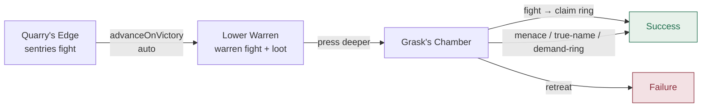
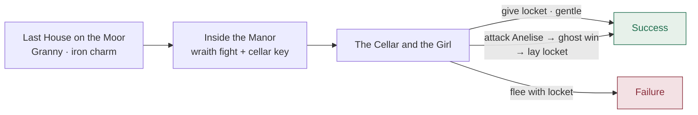
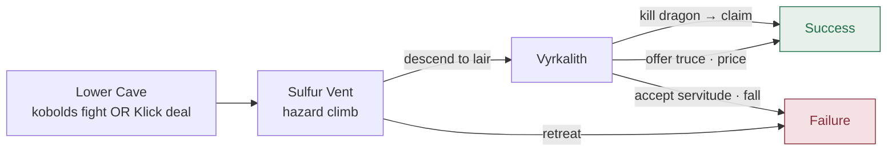

# Campaigns

Three hand-authored campaigns ship in `lib/dm/campaigns/*.ts`. Each has three scenes, a set of scripted encounters, DM briefing text, and both a success and a failure ending. They differ in tone, difficulty, and how much combat vs. social play they lean on.

| Campaign | Levels | Tone | Difficulty | Combat weight |
|---|---|---|---|---|
| [The Goblin Warrens](#the-goblin-warrens) | 1–3 | Pulp Action | Low | Heavy — three encounters, boss brawl |
| [The Haunted Manor](#the-haunted-manor) | 3–5 | Gothic Horror | Mid | Medium — one wraith fight, one optional ghost fight |
| [The Wyrm's Hollow](#the-wyrms-hollow) | 7–10 | High Fantasy | High | Boss-shaped — one big fight, negotiable |

Every campaign closes at `SUCCESS_END` or `FAILURE_END` (see `lib/dm/types.ts`). The success/failure conclusion text below is quoted from the templates.

---

## The Goblin Warrens

- **Level:** 1–3
- **Tone:** Pulp Action
- **Difficulty:** Low
- **Scenes:** 3
- **Template:** `lib/dm/campaigns/goblin-warrens.ts`

> A merchant caravan was raided on the King's Road. The trail leads to a warren of goblin tunnels under an old quarry.

### Scenes

**I. The Quarry's Edge** &nbsp;·&nbsp; `scene:approach`
Two goblin sentries argue on a rock outcrop above a cave mouth at dusk. **Fight the sentries**, sneak past, or offer to talk (they refuse). **Fight-gate scene:** winning auto-advances into the warren (`advanceOnVictory: "scene:warren"`).

**II. The Lower Warren** &nbsp;·&nbsp; `scene:warren`
Three goblins by a fire, sleeping pallets, an iron-bound strongbox pried open but not opened. **Fight the warren**, then loot: pallets, the strongbox (locked — key is with Grask), dead-end side tunnels. Rewards on advance: **150 XP + Potion of Healing**.

**III. Grask's Chamber** &nbsp;·&nbsp; `scene:chief`
Grask, the warlord, and two bodyguards. **Fight** for the ring, or intimidate / true-name / pickpocket for a bloodless win. Rewards on success: **250 XP + Grask's shortsword +1**.

### Scene flow

### Endings

> **Success** — *"The warren is silent behind you. Grask's ring is heavy in your pocket, and the caravan's owner is going to pay a great deal to see it again."*

> **Failure** — *"You leave the way you came. The trail cools. Somewhere, a warlord you disturbed is nailing a new sign to a tree."*

---

## The Haunted Manor

- **Level:** 3–5
- **Tone:** Gothic Horror
- **Difficulty:** Mid
- **Scenes:** 3
- **Template:** `lib/dm/campaigns/haunted-manor.ts`

> A village beyond the moor has stopped sending its tribute. The last messenger came back gibbering about a manor on a hill that should not be there.

### Scenes

**I. The Last House on the Moor** &nbsp;·&nbsp; `scene:village`
Granny Falsom names the manor's dead witch and her forgotten daughter. Talk-heavy; no combat. Take her iron charm (advantage on the next fear save). Advance to the manor.

**II. Inside the Manor** &nbsp;·&nbsp; `scene:foyer`
A manor forty years too preserved. A child's laughter drifts between rooms. **A wraith attacks** when you press toward the cellar. After the fight, find the brass cellar key on a long-dead servant.

**III. The Cellar and the Girl** &nbsp;·&nbsp; `scene:cellar`
Mireille's bones and the velvet locket. Anelise waits at the top of the stairs — *not hostile*. Give her the locket (gentle path → success), or attack her (**ghost fight**) then lay the locket where she fell, or flee with it (failure).

### Scene flow

### Endings

> **Success** — *"Where the manor stood, there is only an old foundation and ash. The locket is warm in someone's pocket, and getting warmer."*

> **Failure** — *"The manor does not leave you. Somewhere in the fog, a child is humming a lullaby. Once or twice, when you look back, you almost see her."*

---

## The Wyrm's Hollow

- **Level:** 7–10
- **Tone:** High Fantasy
- **Difficulty:** High
- **Scenes:** 3
- **Template:** `lib/dm/campaigns/wyrms-hollow.ts`

> The shepherds in the high valleys speak of a red shadow on the cliffs at dusk. The lords pay well for a confirmed sighting. They pay better for proof of a kill.

### Scenes

**I. The Lower Cave** &nbsp;·&nbsp; `scene:approach`
Klick's kobolds guard the road. **Fight** your way through, or lead with talk and trade her clan's survival for the upper path. Either way you emerge with the route to Vyrkalith.

**II. The Sulfur Vent** &nbsp;·&nbsp; `scene:vent`
A two-mile hazard climb. No combat. Rest at the outflow vent halfway up; hear Vyrkalith humming to herself on the ledge above. Retreat and the dragon comes hunting (failure).

**III. Vyrkalith** &nbsp;·&nbsp; `scene:lair`
An adult red dragon with one milk-white eye. Match her at conversation, then **strike** — or offer a binding price to leave the valley (truce → success). Accept servitude and the valley keeps one of you (failure).

### Scene flow

### Endings

> **Success** — *"The wind smells, for the first time in three years, of nothing but cold air and stone. Behind you, in the dark of the upper cave, the hum has stopped."*

> **Failure** — *"Smoke rises from the high valley for a week after. Whatever was in the Hollow is no longer in the Hollow. The lords double the bounty."*

---

← Back to [README](./README.md) · Previous: [Story mode](./story-mode.md) · Next: [Reference](./reference.md)
