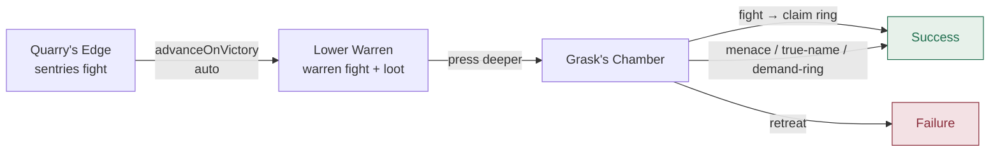

# The Goblin Warrens

- **Level:** 1–3
- **Tone:** Pulp Action
- **Difficulty:** Low
- **Scenes:** 3
- **Template:** `lib/dm/campaigns/goblin-warrens.ts`

> A merchant caravan was raided on the King's Road. The trail leads to a warren of goblin tunnels under an old quarry.

## Scenes

**I. The Quarry's Edge** &nbsp;·&nbsp; `scene:approach`
Two goblin sentries argue on a rock outcrop above a cave mouth at dusk. **Fight the sentries**, sneak past, or offer to talk (they refuse). **Fight-gate scene:** winning auto-advances into the warren (`advanceOnVictory: "scene:warren"`).

**II. The Lower Warren** &nbsp;·&nbsp; `scene:warren`
Three goblins by a fire, sleeping pallets, an iron-bound strongbox pried open but not opened. **Fight the warren**, then loot: pallets, the strongbox (locked — key is with Grask), dead-end side tunnels. Rewards on advance: **150 XP + Potion of Healing**.

**III. Grask's Chamber** &nbsp;·&nbsp; `scene:chief`
Grask, the warlord, and two bodyguards. **Fight** for the ring, or intimidate / true-name / pickpocket for a bloodless win. Rewards on success: **250 XP + Grask's shortsword +1**.

## Scene flow

## Endings

> **Success** — *"The warren is silent behind you. Grask's ring is heavy in your pocket, and the caravan's owner is going to pay a great deal to see it again."*

> **Failure** — *"You leave the way you came. The trail cools. Somewhere, a warlord you disturbed is nailing a new sign to a tree."*

## Design notes

- The **approach** scene is the only campaign scene with `advanceOnVictory` set. It's a pure fight-gate — no post-combat content to linger on, so winning auto-progresses into the warren.
- The **chief** scene is the widest branch in the whole game. Most win-path actions carry `hideAfterVictory: true`, so the moment you kill Grask the menu collapses to just "Claim the ring and leave" (the `requiresVictory` victory beat) plus the loot options.
- **`retreat`** in the chief scene advances to `FAILURE_END` — an explicit "this is too much" escape hatch. Also flagged `hideAfterVictory` so it disappears once the fight is won.

---

← [Campaigns](./README.md) · Next: [The Haunted Manor →](./haunted-manor.md)
