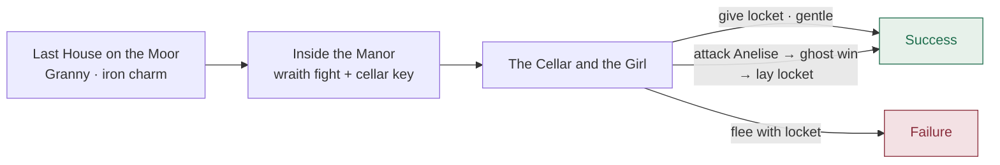

# The Haunted Manor

- **Level:** 3–5
- **Tone:** Gothic Horror
- **Difficulty:** Mid
- **Scenes:** 3
- **Template:** `lib/dm/campaigns/haunted-manor.ts`

> A village beyond the moor has stopped sending its tribute. The last messenger came back gibbering about a manor on a hill that should not be there.

## Scenes

**I. The Last House on the Moor** &nbsp;·&nbsp; `scene:village`
Granny Falsom names the manor's dead witch and her forgotten daughter. Talk-heavy; no combat. Take her iron charm (advantage on the next fear save). Advance to the manor.

**II. Inside the Manor** &nbsp;·&nbsp; `scene:foyer`
A manor forty years too preserved. A child's laughter drifts between rooms. **A wraith attacks** when you press toward the cellar. After the fight, find the brass cellar key on a long-dead servant.

**III. The Cellar and the Girl** &nbsp;·&nbsp; `scene:cellar`
Mireille's bones and the velvet locket. Anelise waits at the top of the stairs — *not hostile*. Give her the locket (gentle path → success), or attack her (**ghost fight**) then lay the locket where she fell, or flee with it (failure).

## Scene flow

## Endings

> **Success** — *"Where the manor stood, there is only an old foundation and ash. The locket is warm in someone's pocket, and getting warmer."*

> **Failure** — *"The manor does not leave you. Somewhere in the fog, a child is humming a lullaby. Once or twice, when you look back, you almost see her."*

## Design notes

- The **village** scene has **no encounter** — it's pure social. Granny gates the exposition (Mireille was a hedge-witch, had a forgotten daughter) but doesn't name Anelise, leaving that reveal for the cellar.
- The **cellar** scene has two paths to the same success ending: gentle (`give-locket`) and violent (`attack-girl` → ghost fight → `lay-locket`). The violent path's resolution beat is the one gated by `requiresVictory`; the gentle beat carries `hideAfterVictory` so it vanishes if you kill her.
- The wraith in the foyer is Caleb the Forgotten — **not** Anelise. The campaign briefing calls this out explicitly to keep the mid-fight anonymity intentional.

---

← [The Goblin Warrens](./goblin-warrens.md) · [Campaigns](./README.md) · [The Wyrm's Hollow →](./wyrms-hollow.md)
