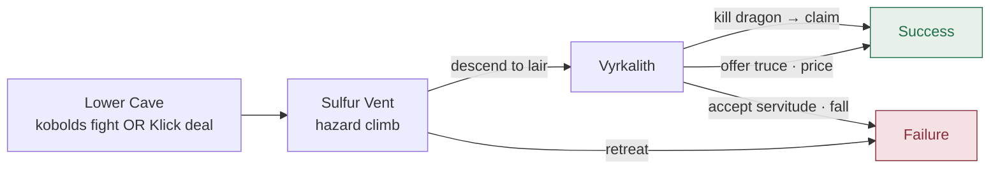

# The Wyrm's Hollow

- **Level:** 7–10
- **Tone:** High Fantasy
- **Difficulty:** High
- **Scenes:** 3
- **Template:** `lib/dm/campaigns/wyrms-hollow.ts`

> The shepherds in the high valleys speak of a red shadow on the cliffs at dusk. The lords pay well for a confirmed sighting. They pay better for proof of a kill.

## Scenes

**I. The Lower Cave** &nbsp;·&nbsp; `scene:approach`
Klick's kobolds guard the road. **Fight** your way through, or lead with talk and trade her clan's survival for the upper path. Either way you emerge with the route to Vyrkalith.

**II. The Sulfur Vent** &nbsp;·&nbsp; `scene:vent`
A two-mile hazard climb. No combat. Rest at the outflow vent halfway up; hear Vyrkalith humming to herself on the ledge above. Retreat and the dragon comes hunting (failure).

**III. Vyrkalith** &nbsp;·&nbsp; `scene:lair`
An adult red dragon with one milk-white eye. Match her at conversation, then **strike** — or offer a binding price to leave the valley (truce → success). Accept servitude and the valley keeps one of you (failure).

## Scene flow

## Endings

> **Success** — *"The wind smells, for the first time in three years, of nothing but cold air and stone. Behind you, in the dark of the upper cave, the hum has stopped."*

> **Failure** — *"Smoke rises from the high valley for a week after. Whatever was in the Hollow is no longer in the Hollow. The lords double the bounty."*

## Design notes

- The **vent** scene is the only middle-scene with **no combat** and a direct failure exit (`retreat` → `FAILURE_END`). It exists to remind the player how badly out of their depth they are before committing to the dragon.
- The **lair** scene has three explicit resolution paths: kill (`fight-dragon` → win → `claim-kill`), truce (`offer-truce` → `SUCCESS_END`), or accept servitude (`accept-servitude` → `FAILURE_END`). All social/negotiation actions carry `hideAfterVictory: true` so they disappear the moment Vyrkalith is dead.
- The `dmBriefing` calls this campaign "boss-shaped" — no shortcuts past the climax, but lots of choice in *how* to arrive. That drives the shape: two "approach" scenes plus one big set piece.

---

← [The Haunted Manor](./haunted-manor.md) · [Campaigns](./README.md)
