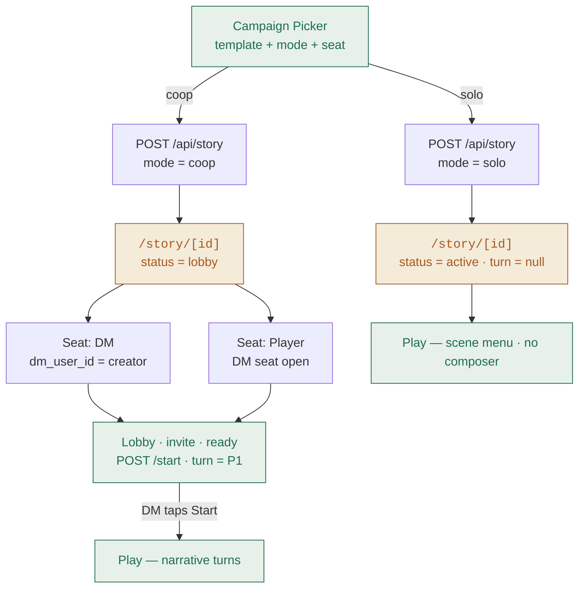
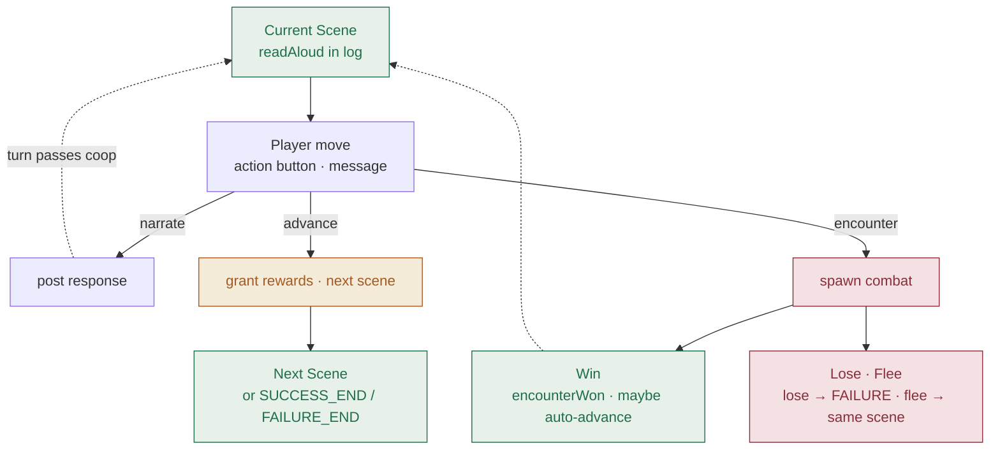

# Story mode

Scripted narrative campaigns. Each campaign is a template of scenes (in `lib/dm/campaigns/*.ts`) with authored read-aloud text, DM notes, player action buttons, and scripted encounters. Play splits by mode:

- **Solo** is button-driven with no free-text composer.
- **Coop** adds a human DM plus a turn-based narrative phase for the players.

Contents:
- [Creating a story](#creating-a-story)
- [Anatomy of a scene](#anatomy-of-a-scene)
- [Solo vs coop play surface](#solo-vs-coop-play-surface)
- [Cross-cutting mechanics](#cross-cutting-mechanics)
- [Combat integration](#combat-integration)

## Creating a story

From the home **Story Mode** button (signed-in only), the `CampaignPickerDialog` collects a template + mode + coop seat. The `POST /api/story` call either seats you straight into play (solo) or into a lobby (coop).

**Coop lobby specifics:** copyable invite URL, DM seat + up to 6 player slots, non-DM players ready up, DM taps Start when at least one player is ready. Non-members opening the invite can join as a player (character picker) or claim the DM seat if open.

## Anatomy of a scene

Every scene is a small state machine: read-aloud posts to the log, the player takes one *move* (an action button, or in coop a free-text message), the effect resolves. There are three effect kinds.

### The three effect kinds

- **narrate** (default when `effect` is absent) — posts a canned response as narrative, no state change. The scene stays live.
- **advance** — moves the scene to a declared transition (next scene, or a conclusion marker) and grants the leaving scene's scripted rewards.
- **encounter** — spawns a coop combat campaign with the story owner's character. Locks the page in the combat dialog until resolved.

## Solo vs coop play surface

The play page is `/story/[id]` for both. What differs is what's on screen:

| Surface | Solo | Coop player | Coop DM |
|---|---|---|---|
| Reading column | Capped at 700px, centered | Flex within party + notes columns | Flex within party + notes columns |
| Party panel | Solo character | Full roster, turn highlighted | Full roster, turn highlighted |
| Action buttons | All authored actions (incl. effects) | Narrate / class actions only, on your turn | Hidden (no character) |
| Free-text composer | Hidden | Player voice, on your turn | Narrate voice, anytime |
| DM Notes panel | Hidden | Hidden | Background · read-aloud · encounters · notes |
| Advance / Trigger | Via player actions only | Never | DM Notes panel + Advance button |

**Why the split?** In solo the lone player *is* the DM by necessity, so they drive world-state changes (encounters, scene advance) through the authored action buttons. In coop a human DM already holds those levers — letting a player unilaterally start a fight or move the scene would step on the DM's pacing.

## Cross-cutting mechanics

All are encoded in `lib/dm/types.ts` and enforced by the play page plus the `/action` and `/advance` routes.

### Turn system (coop story)

`story_campaigns.active_turn_user_id` tracks whose narrative turn it is. One *move* per turn — an action button *or* a free-text message — and it auto-advances in roster `position` order. Solo has no turn column; the lone player drives everything. The DM is outside the rotation and can narrate anytime.

Enforced in `/action` and `/messages` server-side; UI locks off-turn buttons + composer and shows a "{name}'s turn…" hint.

### Action visibility gates

The action menu filters through six gates, in order:

1. **Class gate** — class-restricted actions only appear for the matching class (e.g. rogue's "Pick a lock").
2. **One-shot** — actions vanish after use in the current scene, unless flagged `repeatable`.
3. **requiresVictory** — claim-the-kill beats ("Stand over the fallen dragon", "Claim the ring and leave") stay hidden until this scene's fight is *won*. Enforced server-side too, so a direct API call can't skip the fight.
4. **Coop effect gate** — advance/encounter effects are hidden for coop players; only the DM drives world-state changes.
5. **Spent encounter** — every encounter-triggering action vanishes once the scene's fight is won (they all spawn the same fight).
6. **hideAfterVictory** — pre-combat / "deal with the living enemy" beats collapse after the fight is won, so the menu points at real follow-through.

### Fight-gate auto-advance

A scene may declare `advanceOnVictory: "<transition-target>"`. When set (solo only), winning the encounter auto-advances to the target — the fight *is* the obstacle, no manual "press on" tap needed. Set on scenes with no post-combat content. Coop's DM still drives scene changes manually.

Currently set on: **Goblin Warrens → Quarry's Edge** (the sentries are the only gate).

### Rewards on scene completion

Completing a scene (advancing onward or to the success ending) pays out the leaving scene's scripted rewards to the story's character. A failure ending grants nothing.

- **XP** banks and can trigger level-ups (same path combat uses).
- **Items** — weapons, armor, potions, scrolls — mint real instances from the base catalogs (`lib/dnd/weapons.ts`, `armor.ts`, `potions.ts`, `spells.ts`) and land in the matching bags on the character row.
- **Story rewards** are narrative-only.

Implementation in `lib/dm/rewards.ts`. Combat XP still banks separately via the coop victory path.

### Losing ends the run

A lost encounter concludes the story to `completed_failure` and posts the campaign's failure conclusion. The scene doesn't stay live for re-attempts — the run is over. Flee (`fled` outcome) is not fatal; you disengage and the scene continues.

### Realtime + polling

Every member's play page subscribes to `story:<id>`; every mutating route (messages, action, advance, encounter, start, player, join, combat start/end) broadcasts `updated`. Members refetch on receipt. A slow polling fallback (5s lobby / 10s active) closes any gaps from dropped broadcasts.

## Combat integration

Story combat isn't a separate combat engine — it reuses the coop campaign machinery. When a scene's encounter fires, a fresh coop campaign is spawned and the player's story page opens a locked *combat dialog* that renders the coop battle inline. On resolution, the story page refetches and the outcome message lands in the narrative log.

### Sequence

1. Player triggers an encounter (solo action button, or DM Trigger from the DM Notes panel).
2. `POST /api/story/[id]/combat/start` creates a coop `campaigns` row (status `active`), inserts a `campaign_players` row with the character snapshot, rolls initiative, and sets `active_combat_campaign_id` on the story.
3. Story page opens `StoryCombatDialog`, which mounts the shared `CampaignBattle`. Combat runs turn-by-turn against `/api/campaign/[id]/action`.
4. On the killing blow, the coop action route calls `persistVictoryRewards()` — XP, level-ups, loot, and full HP restore all bank to the persistent character row. Coop campaign flips to `between_encounters`.
5. Player taps **Return to Story**; `POST /api/story/[id]/combat/end` maps the outcome to a system message (`encounter_resolved` with `won` / `lost` / `fled`), clears `active_combat_campaign_id`, and — on a `lost` — flips the story to `completed_failure` and posts the failure conclusion.
6. Story page refetches; the outcome message renders. If the scene declared `advanceOnVictory` and the outcome was `won`, the story auto-advances.

> [!WARNING]
> **Party combat is not wired yet.** Both `combat/start` and the `action` route's `applyEncounter` only enroll the story's *owner* character, not the whole party. A DM triggering an encounter in a coop story where they hold the DM seat (no character) currently 404s. Making encounters a real multi-player fight is the natural next follow-up — see the "Known gaps" section in [Reference](./reference.md).

---

← Back to [README](./README.md) · Next: [Campaigns](./campaigns/README.md)
